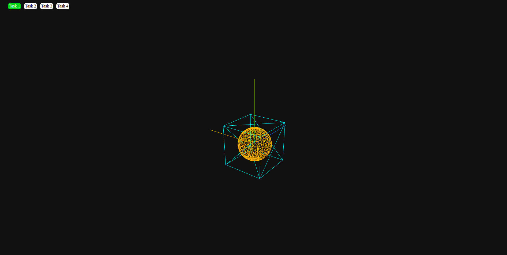
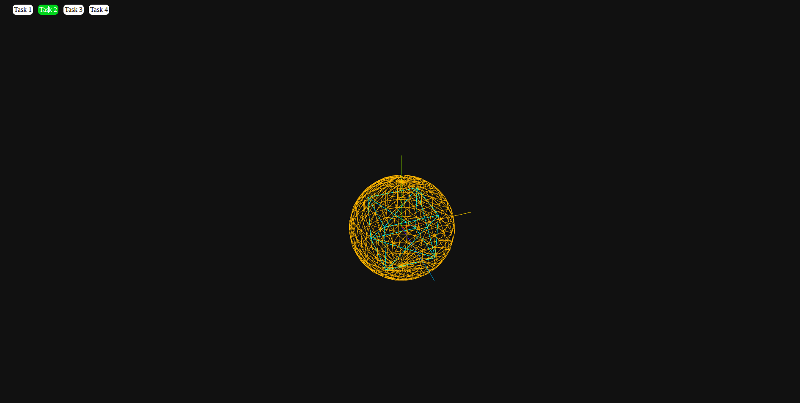
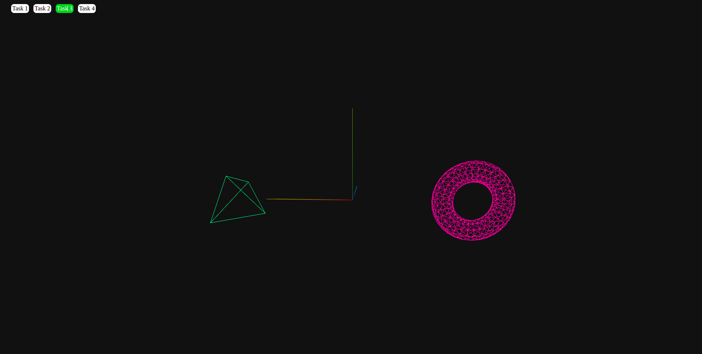
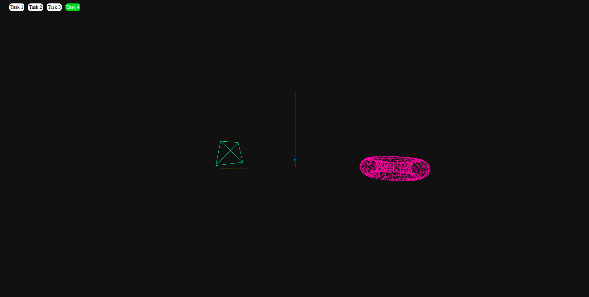
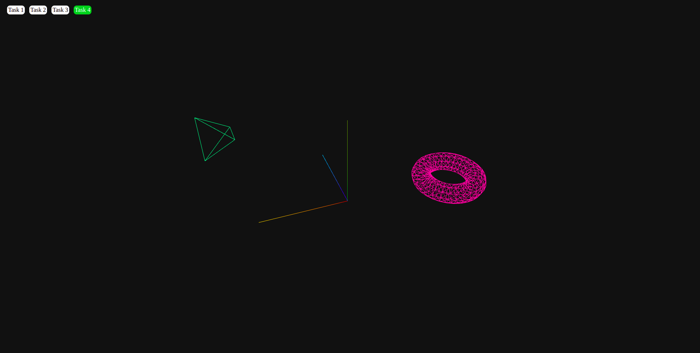

### Звелаке Масеко, 5130904/30103

### Вариант 3

## постановка задания

1. Изобразить каркасный куб и внутри него каркасную сферу.
2. Промасштабировать сферу таким образом, чтобы куб оказался внутри нее.
3. Изобразить тор и тетраэдр. Размеры и местоположение примитивов на экране задать
самостоятельно.
4. Повернуть тор на 90deg вокруг оси Х. Сдвинуть тетраэдр по оси Z.

Выбранный API: WebGL
Язык программирования: Javascript (Three.js)

### Ход работы

**Изобразить каркасный куб и внутри него каркасную сферу**

использовал встроенный метод для создания геометрии, **BoxGeometry** для куба, SphereGeometry для сферы, с указанием метериала, **MeshBasicMaterial**.

параметры куба: 2x2x2
радиус сферы: 0.8

проблема: фигура не каркасная.
решение: включить wireframe

#### скрин-шоты




**Промасштабировать сферу таким образом, чтобы куб оказался внутри нее.**

используем метод scale для увеличения размера сферы, чтобы она имела радиус, позволяющий поглощать куб.
радиус >= растояние до углов куба (sqrt(3 * 2^2))




**Изобразить тор и тетраэдр. Размеры и местоположение примитивов на экране задать
самостоятельно.**

метод для создания тетраэдр и тора: **TetrahedronGeometry**, **TorusGeometry**



**Повернуть тор на 90deg вокруг оси Х. Сдвинуть тетраэдр по оси Z.**

изменяем rotation.x у тора в pi / 2 = 90deg. это вращениеи вокруг Ox.
используем встроенный метод translateZ у тетраэдра для перемещение по OZ






Приложени

Код программы

*task1.js*

```javascript
import { scene, THREE } from "./init.js";


const cubeGeometry = new THREE.BoxGeometry(2, 2, 2);

const cubeMaterial = new THREE.MeshBasicMaterial({
color: 0x00ffff,   // голубой
wireframe: true
});

const cube = new THREE.Mesh(cubeGeometry, cubeMaterial);
cube.position.set(0, 0, 0); 


const sphereGeometry = new THREE.SphereGeometry(0.8, 24, 16);

const sphereMaterial = new THREE.MeshBasicMaterial({
color: 0xffaa00,  
wireframe: true
});

const sphere = new THREE.Mesh(sphereGeometry);
sphere.material = sphereMaterial;
sphere.position.set(0, 0, 0);  // тоже в центре — значит внутри куба

export function task1(){
    scene.children.forEach(mesh => {
        
        if(mesh.type === "Mesh"){
            scene.remove(mesh);
        }
    })
    scene.add(cube);
    scene.add(sphere);
}

export { sphere, cube }

```

*task2.js*

```javascript
import { sphere } from "./task1.js";

export function task2(){
    const SCALE = 2.5;
    sphere.scale.set(SCALE, SCALE, SCALE);
}
```

*task3.js*

```javascript
import { scene, THREE } from "./init.js";
import { sphere } from "./task1.js";

const torusGeometry = new THREE.TorusGeometry(1.0, 0.35, 10, 32);

const torusMaterial = new THREE.MeshBasicMaterial({
color: 0xff44aa,
wireframe: true
});
const torus = new THREE.Mesh(torusGeometry, torusMaterial);
torus.position.set(-4, 0, 0);   


const tetraGeometry = new THREE.TetrahedronGeometry(1.2, 0);

const tetraMaterial = new THREE.MeshBasicMaterial({
color: 0x44ff88, 
wireframe: true
});

const tetra = new THREE.Mesh(tetraGeometry, tetraMaterial);
tetra.position.set(4, 0, 0);

export function task3(){
    scene.remove(sphere);
    scene.children.forEach(mesh => {
        if(mesh.type === "Mesh"){
            scene.remove(mesh);
        }
    })
    scene.add(torus);

    scene.add(tetra);
}
export { tetra, torus }
```

task4.js

```javascript
import { tetra, torus } from "./task3.js";

export function task4(){
    torus.rotation.x = Math.PI / 2;
    tetra.translateZ(3);
}
```

